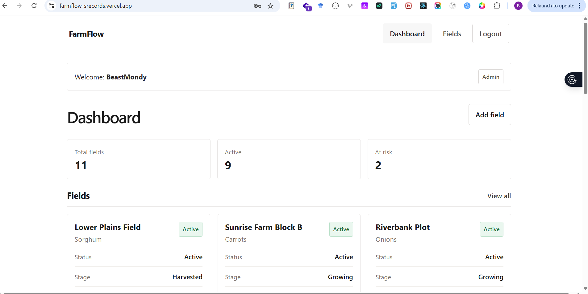

# Farm Flow

## Live Links

- Frontend: https://farmflow-srecords.vercel.app
- Backend: https://farmflow-alpha.vercel.app

## Demo Access

Use any of the accounts below:

- Admin: `admin@gmail.com`
- Agent: `agent@gmail.com`
- Password for both: `12345678`

## About The App

Farm Flow is a field monitoring app for tracking agricultural fields, assigning agents, updating crop progress, and monitoring activity across the team.

The app supports:

- authentication with admin and agent roles
- field creation, editing, and deletion
- agent assignment to fields
- field status calculation: `Active`, `At Risk`, and `Completed`
- notes and update logging through `field_updates`
- admin user management from the dashboard

## Frontend Preview



## Tech Stack

- Frontend: React, Vite, React Router, Axios, React Toastify
- Backend: Node.js, Express
- Database: MySQL / MariaDB
- Auth: JWT in HTTP-only cookies
- Deployment: Vercel

## Project Structure

```text
farm-flow/
├─ frontend/
├─ backend/
├─ assets/
│  ├─ farm-flow.sql
│  └─ frontend.png
└─ README.md
```

## Database Setup

The SQL dump to import is:

- [`assets/farm-flow.sql`](assets/farm-flow.sql)

### Option 1: Use your own MySQL or MariaDB

1. Create a database.
2. Import `assets/farm-flow.sql`.
3. Update the backend `.env` with your database credentials.

### Option 2: Use a free hosted SQL database

You can create one from:

- https://www.freesqldatabase.com/account

Register for a free database, then import the SQL file and use the provided credentials in the backend `.env`.

## Backend Setup

### 1. Install dependencies

```bash
cd backend
npm install
```

### 2. Configure environment variables

Create or update `backend/.env` with values like:

```env
PORT=5000
DB_HOST=your-host
DB_USER=your-user
DB_PASSWORD=your-password
DB_DATABASE=your-database
JWT_SECRET=your-secret
JWT_EXPIRES=7d
COOKIE_EXPIRES=7
```

### 3. Important frontend origin note

The backend CORS origin is currently hardcoded in:

- [`backend/config/constants.js`](backend/config/constants.js)

It is set to:

```js
const FRONTEND_URL = "https://farmflow-srecords.vercel.app";
```

If you want to run a different frontend URL locally or deploy to another domain, update that value before starting the backend.

### 4. Run the backend

```bash
npm start
```

Default local API:

- `http://localhost:5000`

## Frontend Setup

### 1. Install dependencies

```bash
cd frontend
npm install
```

### 2. Configure environment variables

Create `frontend/.env` with:

```env
VITE_API_BASE_URL=http://localhost:5000
```

For production, set it to your deployed backend:

```env
VITE_API_BASE_URL=https://farmflow-alpha.vercel.app
```

### 3. Run the frontend

```bash
npm run dev
```

Default local frontend:

- `http://localhost:5173`

Note: if your frontend runs on a different URL than the hardcoded backend CORS origin, update [`backend/config/constants.js`](backend/config/constants.js) to match.

## Build Commands

### Frontend

```bash
cd frontend
npm run build
```

### Backend

```bash
cd backend
npm start
```

## Main User Flows

### Admin can:

- log in and view all fields
- create fields
- assign agents
- edit or delete any field
- view all users
- edit user details and roles
- delete users

### Agent can:

- log in and view fields
- edit only fields assigned to them
- update stage
- add notes and observations
- create a field update record linked to their agent id

## Field Status Logic

Field status is computed from `current_stage` and `planting_date`.

- `Completed`: field has reached harvest
- `At Risk`: field has remained too long in an early stage
- `Active`: all other ongoing fields

This logic is handled in the backend so the frontend can display the returned `status` directly.

## API Notes

Main API groups:

- `/api/v1/auth`
- `/api/v1/agents`
- `/api/v1/fields`

Authentication uses a JWT stored in an HTTP-only cookie.

## Deployment Notes

### Frontend on Vercel

- set `VITE_API_BASE_URL` to your deployed backend URL
- current deployed backend: `https://farmflow-alpha.vercel.app`

### Backend on Vercel

- configure all DB and JWT environment variables
- make sure the SQL database is reachable from the deployed backend
- if the frontend domain changes, update `FRONTEND_URL` in [`backend/config/constants.js`](backend/config/constants.js)

## Quick Start

1. Import [`assets/farm-flow.sql`](assets/farm-flow.sql) into a MySQL database.
2. Set backend environment variables in `backend/.env`.
3. Set frontend environment variable `VITE_API_BASE_URL`.
4. Start the backend with `npm start` inside `backend`.
5. Start the frontend with `npm run dev` inside `frontend`.
6. Log in with the demo admin or agent account.
